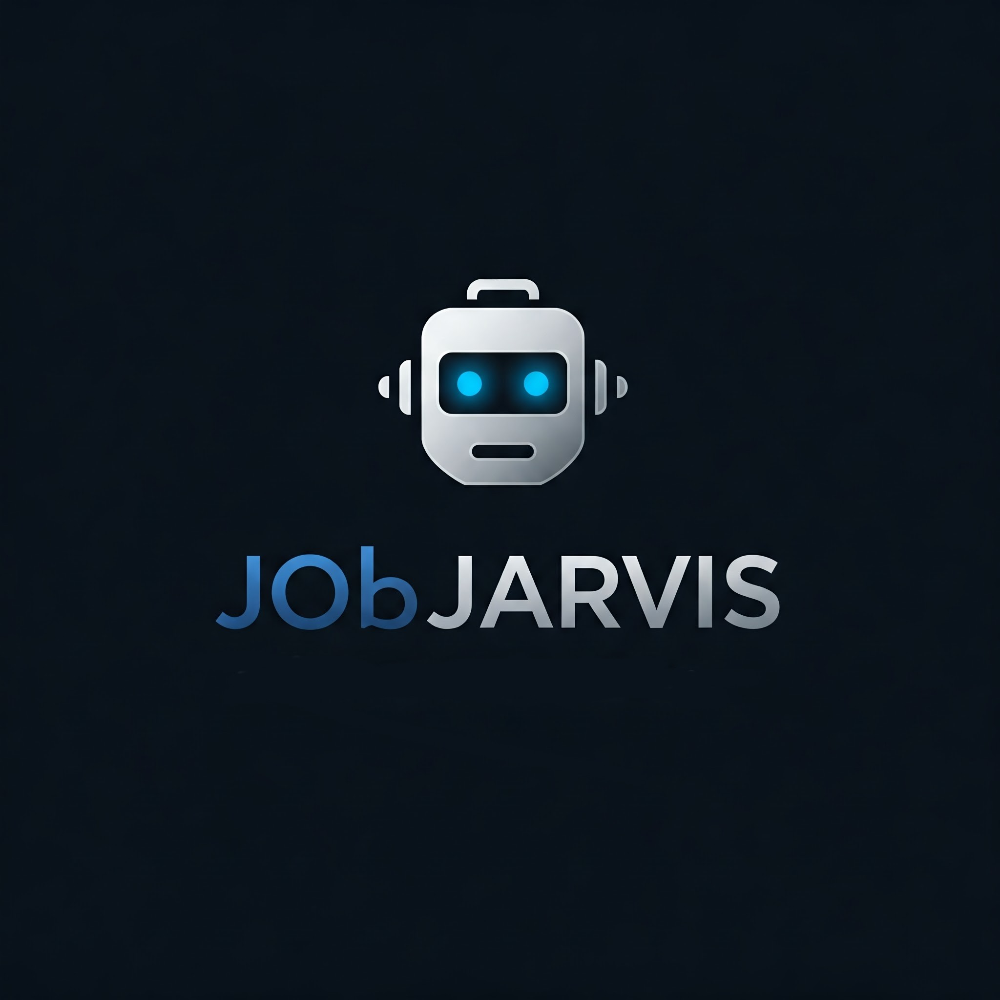

# Job Jarvis - AI-Powered Job Application Assistant

  

Job Jarvis is a Chrome extension that uses AI to automatically fill out job application forms, making your job search process faster and more efficient.

> **AI Disclaimer:** This project was generated 99% by AI, including code, documentation, and design.

> **Note:** This is the basic version of Job Jarvis. We plan to add more features and improvements in future releases. Stay tuned for updates!

## Features

- 🤖 AI-powered form detection and filling
- 📄 Resume parsing and data extraction
- 🔒 Secure local storage of your information
- 🎯 Smart field mapping for accurate form filling
- 🔄 Automatic handling of various input types
- 📱 Modern, responsive UI

### Demo Screenshots

## Installation

1. Clone this repository or download the ZIP file
2. Open Chrome and navigate to `chrome://extensions/`
3. Enable "Developer mode" in the top right corner
4. Click "Load unpacked" and select the extension directory

## Setup

1. Get your Gemini API key from [Google AI Studio](https://makersuite.google.com/app/apikey)
2. Click the Job Jarvis icon in your Chrome toolbar
3. Enter your API key in the setup screen
4. Upload your resume (PDF format)
5. You're ready to start auto-filling job applications!

## Usage

1. Navigate to any job application form
2. Click the Job Jarvis icon in your Chrome toolbar
3. Click the "Auto-Fill Application" button
4. Review and submit the application

## Privacy & Security

- Your data is stored locally in your browser
- Your resume and personal information never leave your computer except when filling out applications
- API keys are stored securely using Chrome's built-in storage system

## Technical Details

- Built with vanilla JavaScript
- Uses Chrome Extension Manifest V3
- Integrates with Google's Gemini AI for intelligent form analysis
- PDF.js for resume parsing
- Modern async/await pattern for API calls

## Contributing

Contributions are welcome! Please feel free to submit a Pull Request.

## License

This project is licensed under the MIT License - see the LICENSE file for details.

## Credits

### Third-Party Libraries
- [PDF.js](https://mozilla.github.io/pdf.js/) - Mozilla's PDF viewer built with HTML5 (Apache License 2.0)

### Icons and Assets
- <a href="https://www.flaticon.com/free-icons/artificial-intelligence" title="artificial intelligence icons">Artificial intelligence icons created by FACH - Flaticon</a>

### Dependencies
- Google's Gemini AI API - For form analysis and field mapping
- Chrome Extension APIs - For browser integration

## Support

If you encounter any issues or have questions, please file an issue on the GitHub repository.

---
Made with ❤️ for job seekers everywhere
